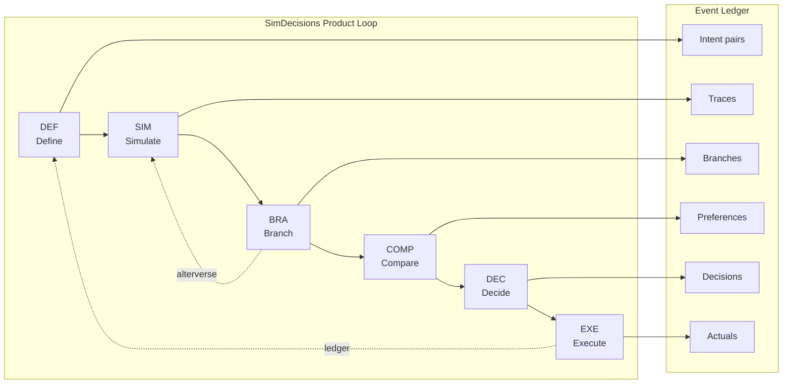

# SPEC-WEBSITE-UPDATE-1000BULBS-001: Website Portfolio Page + Home Page Updates

## Priority
P0

## Depends On
- SPEC-PORTFOLIO-CURATE-001

## Model Assignment
sonnet

## Objective

Update simdecisions.com (served from browser/) to support the 1000bulbs job application: add a Portfolio page linking to the public teaser repo, update the Core Loop section with Event Ledger emissions, add "Built With" and PROCESS-13 callout sections, and update nav. The site uses React + Vite with an EGG-based routing system (no react-router) — the landing page is `browser/src/pages/SimDecisionsLanding.tsx`.

## Files to Read First

- browser/src/pages/SimDecisionsLanding.tsx
- browser/src/App.tsx
- browser/src/primitives/top-bar/TopBar.tsx
- browser/src/sets/eggResolver.ts
- browser/src/pages/LandingPage.tsx
- browser/vite.config.ts
- docs/portfolio/1000bulbs-teaser-README.draft.md

## Acceptance Criteria

### Portfolio Page
- [ ] File `browser/src/pages/Portfolio.tsx` exists
- [ ] Portfolio page contains "Selected Works" header
- [ ] Portfolio page contains SimDecisions card with description, signal badges ([Multi-Tier] [Agent Orchestration] [CI/CD] [12-Factor]), and link to github.com/deiasolutions/simdecisions-architecture
- [ ] Portfolio page contains PRISM-IR card with description, badges ([Open Source] [Apache 2.0]), and link to github.com/deiasolutions/prism-ir
- [ ] Portfolio page contains "How I Work With AI Agents" section with Hive hierarchy diagram
- [ ] Portfolio page contains "Architecture Overview" section with multi-tier diagram (view / API Gateway / service / persistence / database)
- [ ] Portfolio page contains contact CTA with LinkedIn + GitHub links only (no email)
- [ ] Portfolio page is mobile-responsive (uses CSS variables, no hardcoded widths > 100%)

### Navigation Update
- [ ] Portfolio link added to site navigation (between Process and About)
- [ ] Nav order is: Framework | Process | Portfolio | About | Blog | GitHub
- [ ] Portfolio link routes correctly to the portfolio page

### Home Page Updates
- [ ] Core Loop section updated with Mermaid diagram showing 6 stages + Event Ledger emissions + feedback loops (EXE→DEF continuous, BRA→SIM alterverse)
- [ ] "Built With" section added showing: Frontend: React (Vercel), Backend: FastAPI (Railway), Database: PostgreSQL (Railway), CI/CD: GitHub Actions, Orchestration: DEIA Hive
- [ ] PROCESS-13 callout added with quote: "Builder bees cannot test their own output" and 3-phase validation explanation

### Styling and Standards
- [ ] All colors use `var(--sd-*)` CSS variables — no hex, rgb, or named colors
- [ ] No file exceeds 500 lines
- [ ] Components follow existing patterns in browser/src/pages/

### EGG Routing Integration
- [ ] Portfolio page is reachable (either via EGG resolver, query param, or standalone page map in App.tsx)
- [ ] Portfolio page renders correctly when accessed

## Smoke Test

- [ ] `grep -r "Portfolio" browser/src/pages/Portfolio.tsx` returns matches
- [ ] `grep -r "Selected Works" browser/src/pages/Portfolio.tsx` returns matches
- [ ] `grep "Portfolio" browser/src/App.tsx` confirms route/page registered
- [ ] `grep -r "rgb\|#[0-9a-fA-F]" browser/src/pages/Portfolio.tsx` returns no matches (no hardcoded colors)
- [ ] `cd browser && npx tsc --noEmit` exits 0 (no TypeScript errors introduced)

## Constraints

- All colors: `var(--sd-*)` CSS variables only — no hex, no rgb(), no named colors
- No file over 500 lines
- No stubs — every component complete and renderable
- No git operations
- Follow existing page patterns (see SimDecisionsLanding.tsx for reference)
- The site does NOT use react-router — it uses EGG-based resolution via eggResolver.ts and standalone page maps in App.tsx. New pages must integrate with this system.
- Contact: LinkedIn + GitHub links only, no email
- Mermaid diagrams: use `mermaid` code blocks (Vite/React renders these if a Mermaid plugin is present; if not, use a static SVG or pre-rendered approach consistent with existing site patterns)
- Mobile-responsive: test at 375px width minimum

## Content Specifications

### Core Loop Mermaid (Home Page)



### Built With Section

```
Built With:
- Frontend: React (Vercel)
- Backend: FastAPI (Railway)
- Database: PostgreSQL (Railway)
- CI/CD: GitHub Actions
- Orchestration: DEIA Hive
```

Format as small badges or icon row — signals presence without being prominent.

### PROCESS-13 Callout

```
AI Correction Discipline

"Builder bees cannot test their own output."

Every AI-generated artifact passes through a three-phase validation gate:
1. Validate Plan — before code is written
2. Execute with Self-Check — builder generates with inline validation
3. Independent Validation — separate agent validates output

This is holdout-set methodology applied to AI development.
```

### Nav Update

Current: Framework | Process | About | Blog | GitHub
Updated: Framework | Process | **Portfolio** | About | Blog | GitHub
