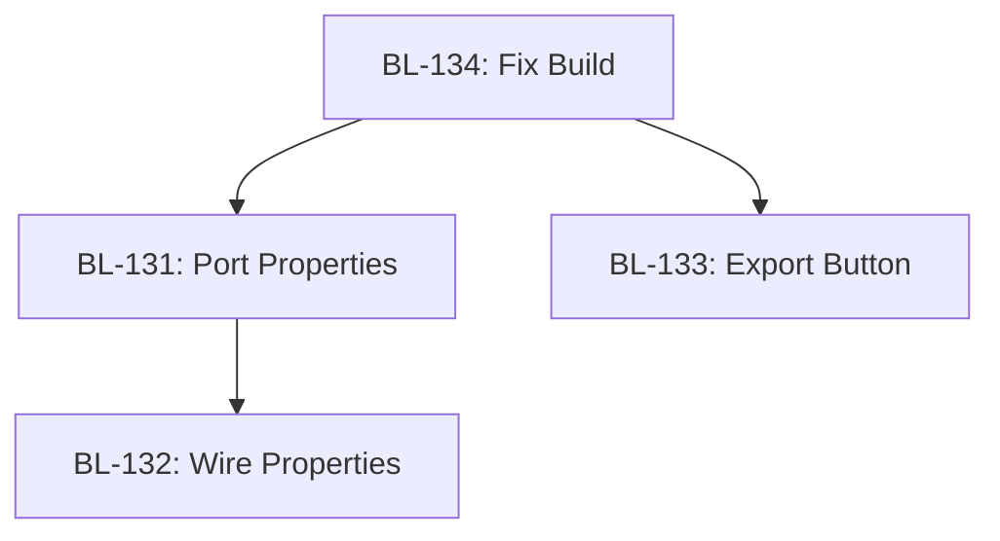

# Wave Planner (Batch Work Breakdown)

## Steps

### Step 1: Understand Wave Definitions

Waves organize work items by urgency, dependencies, and parallelizability:

**Wave 0 (Critical Solo):**
- **When:** Blocking issue, must complete before anything else
- **Execution:** Single bee, all other bees wait
- **Examples:** Broken build, missing dependency, deployment blocker
- **Rule:** Only ONE item in Wave 0. If multiple critical items, sequence them.

**Wave A (Parallel Foundation):**
- **When:** Independent foundational work, no inter-dependencies
- **Execution:** Parallel dispatch, multiple bees
- **Examples:** New modules, independent features, config files
- **Rule:** Items in Wave A cannot depend on each other

**Wave B (Parallel Extension):**
- **When:** Independent work that extends Wave A results
- **Execution:** Parallel dispatch after Wave A completes
- **Examples:** Additional features, tests for Wave A modules, documentation
- **Rule:** May depend on Wave A, but not on each other

**Wave C (Integration Layer 1):**
- **When:** Combines Wave A/B results, first integration
- **Execution:** Sequential or limited parallel (2-3 bees max)
- **Examples:** Wiring modules together, route registration, UI integration
- **Rule:** Depends on Wave A or B completion

**Wave D (Integration Layer 2):**
- **When:** Final integration, end-to-end wiring
- **Execution:** Sequential, often single bee
- **Examples:** Full stack integration, smoke tests, deployment
- **Rule:** Depends on Wave C completion

**Wave E (Greenfield Exploration):**
- **When:** Experimental, future work, not blocking alpha
- **Execution:** Solo bee, low priority, deferred
- **Examples:** Prototypes, research spikes, future features
- **Rule:** Never blocks other waves

### Step 2: Triage Each Work Item

For each item in the batch, classify:

**Tier (model assignment):**
- **Haiku** — trivial (< 200 LOC, simple logic, config, tests)
- **Sonnet** — medium (200-1000 LOC, moderate complexity, integration)
- **Opus** — complex (> 1000 LOC, architectural decisions, system-wide changes)

**Type:**
- **code** — writing or modifying code
- **research** — investigation, survey, gap analysis
- **clerical** — file organization, archival, cleanup
- **strategic** — high-level decisions, stays with Q33NR + Q88N

**Dependencies:**
- List other items this one depends on (blocks on)
- List other items that depend on this one (blocks)

**Parallelizable:**
- **Yes** — no shared file writes, no ordering requirement
- **No** — writes to same files, must sequence

### Step 3: Build Dependency Graph

Create a directed acyclic graph (DAG) of dependencies:

```
Item A
  ↓ (A blocks B)
Item B
  ↓ (B blocks C)
Item C

Item D (no dependencies)
Item E (no dependencies)

D and E can run in parallel with A.
B must wait for A.
C must wait for B.
```

**Tools:**
- Text representation (markdown list with arrows)
- Mermaid graph (optional, for visualization)

### Step 4: Assign Items to Waves

**Algorithm:**

1. **Wave 0:** Any item marked "blocking" or "critical" → Wave 0. If multiple, sequence by urgency.

2. **Wave A:** Items with NO dependencies → Wave A.

3. **Wave B:** Items that depend ONLY on Wave A items → Wave B.

4. **Wave C:** Items that integrate Wave A/B results → Wave C.

5. **Wave D:** Items that integrate Wave C results or require full stack → Wave D.

6. **Wave E:** Items marked "greenfield" or "future" → Wave E.

**Parallelization check:**
- Within Wave A or B: if two items write to the same file, they CANNOT run in parallel. Sequence them or move one to the next wave.

### Step 5: Write Batch Briefing

Create a single coordination briefing covering all waves:

**File:** `.deia/hive/coordination/YYYY-MM-DD-HHMM-BRIEFING-{BATCH-NAME}.md`

**Template:**

```markdown
# Briefing: {Batch Name}

**From:** Q33NR
**To:** Q33N
**Date:** YYYY-MM-DD
**Priority:** P0 | P1 | P2

---

## Objective

{What this batch accomplishes in 1-2 sentences}

---

## Wave Breakdown

### Wave 0 (Critical Solo)
- **Item:** {ID} — {title}
- **Tier:** {haiku/sonnet/opus}
- **Why Wave 0:** {blocking reason}
- **Dispatch:** Single bee, all others wait

### Wave A (Parallel Foundation)
- **Item 1:** {ID} — {title} — **Tier:** {tier}
- **Item 2:** {ID} — {title} — **Tier:** {tier}
- **Item 3:** {ID} — {title} — **Tier:** {tier}
- **Dispatch:** Parallel (max 3-5 bees)
- **Dependencies:** None (all independent)

### Wave B (Parallel Extension)
- **Item 4:** {ID} — {title} — **Tier:** {tier} — **Depends on:** Wave A complete
- **Item 5:** {ID} — {title} — **Tier:** {tier} — **Depends on:** Wave A complete
- **Dispatch:** Parallel after Wave A completes

### Wave C (Integration Layer 1)
- **Item 6:** {ID} — {title} — **Tier:** {tier} — **Depends on:** Wave A, B complete
- **Dispatch:** Sequential or limited parallel (2 bees max)

### Wave D (Integration Layer 2)
- **Item 7:** {ID} — {title} — **Tier:** {tier} — **Depends on:** Wave C complete
- **Dispatch:** Sequential (single bee)

### Wave E (Greenfield)
- **Item 8:** {ID} — {title} — **Tier:** {tier}
- **Dispatch:** Deferred, low priority

---

## Dependency Graph

```
Wave 0: Item 1 (blocking)
  ↓
Wave A: Item 2 || Item 3 || Item 4
  ↓
Wave B: Item 5 || Item 6
  ↓
Wave C: Item 7
  ↓
Wave D: Item 8

Wave E: Item 9 (deferred)
```

---

## Strategic Items (Stay with Q33NR + Q88N)

{List any strategic items not delegated to Q33N}

---

## Conventions to Follow

- No hardcoded colors (CSS vars only)
- No file over 500 lines
- TDD for all code changes
- All paths absolute
- Response files required from all bees

---

## Files Q33N Must Read Before Writing Tasks

{List relevant specs, BOOT.md sections, existing modules}

---

## Constraints

{Any batch-wide constraints}
```

### Step 6: Dispatch Q33N with Briefing

Use dispatch.py to send the briefing to Q33N:

```bash
python .deia/hive/scripts/dispatch/dispatch.py \
  .deia/hive/coordination/YYYY-MM-DD-HHMM-BRIEFING-{BATCH-NAME}.md \
  --model sonnet \
  --role queen
```

Q33N will:
1. Read briefing
2. Write task files for each wave
3. Dispatch bees per wave (Wave 0 → Wave A → Wave B → ...)
4. Report results back to Q33NR

### Step 7: Hold the Line (While Batch Runs)

Q33NR stays with Q88N for strategic work. Do NOT micromanage Q33N or individual bees. Wait for rollup report from Q33N.

### Step 8: Review Rollup Report from Q33N

When Q33N reports completion, summarize to Q88N:

```markdown
# Batch Rollup: {Batch Name}

**Status:** {N}/{M} items complete

## Completed
- Wave 0: {Item 1} — COMPLETE
- Wave A: {Item 2, 3, 4} — COMPLETE
- Wave B: {Item 5} — COMPLETE, {Item 6} — FAILED (reason)
- Wave C: {Item 7} — COMPLETE
- Wave D: {Item 8} — BLOCKED (Wave B failure)
- Wave E: {Item 9} — DEFERRED

## Failed / Blocked
- {Item 6}: {failure reason}
- {Item 8}: Blocked by Wave B failure

## Next Steps
- Fix {Item 6} issue: {diagnostic}
- Retry Wave D after fix
```

## Output Format

### Triage Table

Before writing briefing, produce a triage table:

```markdown
| ID | Title | Tier | Type | Depends On | Blocks | Parallelizable | Wave |
|----|-------|------|------|------------|--------|----------------|------|
| BL-131 | Port Properties Panel | Sonnet | code | None | BL-132 | Yes | A |
| BL-132 | Wire Properties to Canvas | Sonnet | code | BL-131 | None | No | C |
| BL-133 | Add Export Button | Haiku | code | None | None | Yes | A |
| BL-134 | Fix Build Error | Haiku | code | None | ALL | No | 0 |
```

### Dependency Graph (Text)

```
Wave 0: BL-134 (blocks all)
  ↓
Wave A: BL-131 || BL-133
  ↓
Wave C: BL-132 (depends on BL-131)
```

### Dependency Graph (Mermaid, Optional)



## Gotchas

### 1. Wave 0 Is Not a Dumping Ground
Only truly blocking items go in Wave 0. "High priority" ≠ "Wave 0". Wave 0 means "nothing else can proceed until this is done."

### 2. Hidden Dependencies Kill Parallelization
Two items may seem independent but both modify the same file → cannot run in parallel. Always check file paths.

### 3. Strategic Items Stay with Q33NR
If an item requires high-level decisions, architectural judgment, or Q88N input, it does NOT get delegated to Q33N. Q33NR handles it directly.

### 4. Max 5 Parallel Bees (Hard Rule)
Even if Wave A has 10 items, dispatch max 5 bees at once. Batch the rest (Wave A1, Wave A2).

### 5. Integration Work Is Never Parallel
Wave C and D are integration layers. Don't try to parallelize them — they require seeing the full picture.

### 6. Greenfield Work Is Deferred
Wave E items do NOT block alpha, do NOT consume budget during sprint. They are "nice to have" research.

### 7. Dependency Graph Must Be Acyclic
If A depends on B and B depends on A → circular dependency, breaks wave system. Resolve by refactoring or sequencing.

### 8. Briefing File Naming
Use: `YYYY-MM-DD-HHMM-BRIEFING-{BATCH-NAME}.md`
Not: `YYYY-MM-DD-HHMM-{AGENT}-{BATCH-NAME}-ASSIGNMENT.md` (that's a task file format)

### 9. Wave Numbering Is Semantic, Not Sequential
You don't need all waves for every batch. If no integration work, skip Wave C/D. If no critical blocker, skip Wave 0.

### 10. [UNDOCUMENTED — needs process doc]
How to handle mid-wave failures (e.g., Wave A item 2 fails, but items 1 and 3 succeed). Current practice: Wave B proceeds with partial Wave A results, failed item moves to fix queue. No formal rollback mechanism exists.

### 11. [UNDOCUMENTED — needs process doc]
Budget allocation across waves. Current practice: no per-wave budget, only session budget. If Wave A consumes 80% of budget, Wave B may get truncated. No formal wave-level budgeting exists.

### 12. Batch Briefings Are One-Shot
Unlike task files (which get archived), briefings stay in `.deia/hive/coordination/` for historical reference. They are NOT moved to `_done/` or `_archive/`.
