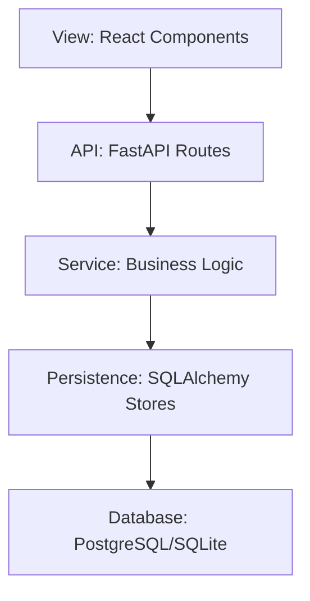
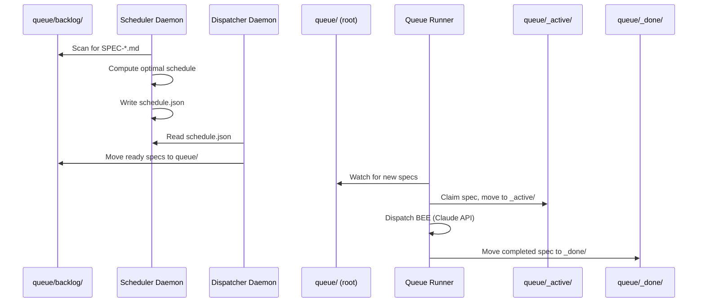
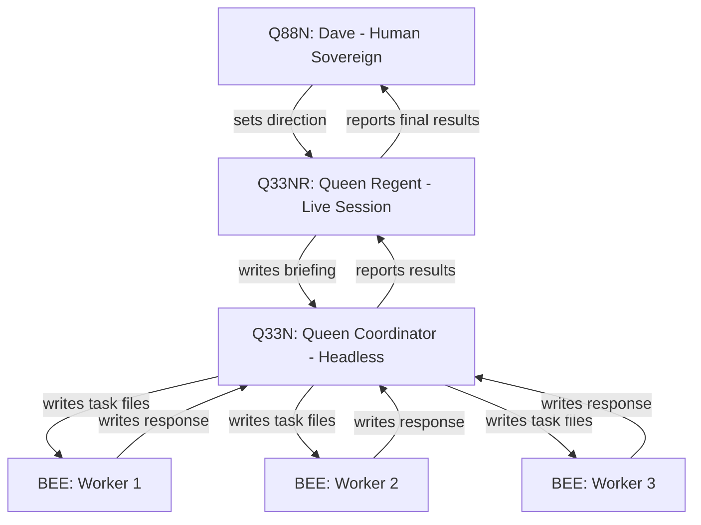
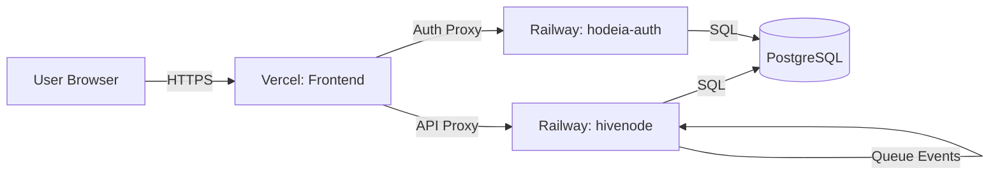
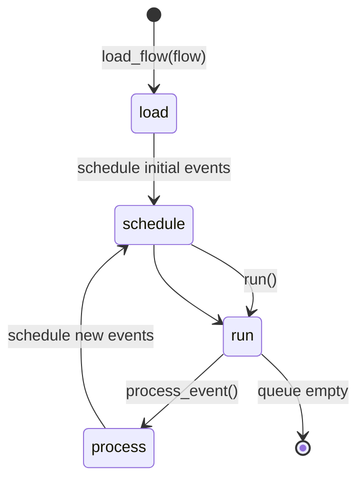

# Architecture

**Author:** Dave Eichler
**Contact:** linkedin.com/in/daaaave-atx

This document describes the architecture of the simdecisions system using diagrams and plain-English explanations.

## 5-Tier Architecture

**Plain English:** The system has 5 layers. At the top, React components render the UI. They talk to FastAPI routes (the API layer). Those routes call service functions (business logic). Services use SQLAlchemy stores to read/write data. At the bottom, PostgreSQL (cloud) or SQLite (local) stores the data.

**Example:** When you submit a new task in the UI, the React component calls a FastAPI endpoint. The endpoint calls the scheduler service. The scheduler updates the schedule in the database via SQLAlchemy.

---

## Factory Flow (Scheduler → Dispatcher → Queue Runner)

**Plain English:** The factory loop has three daemons that work together:

1. **Scheduler** scans the backlog, computes an optimal task schedule (using OR-Tools CP-SAT solver), and writes schedule.json.
2. **Dispatcher** reads schedule.json, checks how many bees are active, and moves ready specs from backlog/ to queue/.
3. **Queue Runner** watches queue/, claims specs, dispatches bees (calls Claude API), and moves completed specs to _done/.

**Why this matters:** This lets the system process dozens of tasks automatically without human intervention. The scheduler optimizes for constraints (min/max parallel bees). The dispatcher ensures the queue doesn't overflow. The runner handles retries and error logging.

---

## Hive Hierarchy (Q88N → Q33NR → Q33N → BEEs)

**Plain English:** The hive is a chain of command for AI agents:

- **Q88N (Dave):** The human sovereign. Sets direction, approves plans, makes final decisions.
- **Q33NR (Queen Regent):** A live Claude session that talks to Dave. Writes briefings, reviews task files, reports results. **Does NOT write code.**
- **Q33N (Queen Coordinator):** A headless Claude session that reads briefings, writes task files, and dispatches bees. **Does NOT write code unless explicitly approved.**
- **BEEs (Workers):** Headless Claude sessions that write code, run tests, and write response files. **Do NOT orchestrate or dispatch other bees.**

**Why this matters:** This hierarchy prevents chaos. BEEs only write code. Q33N only coordinates. Q33NR only manages Q33N and reports to Dave. No bee can rewrite the system or dispatch other bees. This makes the system auditable and safe.

---

## Deployment Topology

**Plain English:** The system is deployed across three services:

1. **Vercel:** Serves the React frontend (browser/). Users visit simdecisions.com and hit Vercel first.
2. **Railway (hivenode):** Runs the FastAPI backend (hivenode/). Handles API requests, file storage, factory loop, event ledger.
3. **Railway (hodeia-auth):** Runs the auth service (hodeia_auth/). Issues JWTs, handles OAuth callbacks, cross-app SSO.

All three talk to the same PostgreSQL database on Railway. Vercel proxies API + auth requests to Railway (see vercel.json routes).

**Why this matters:** Separating frontend and backend lets them scale independently. Using Railway for backend gets us auto-restart, health checks, and managed PostgreSQL. Using Vercel for frontend gets us global CDN and instant deploys.

---

## Discrete Event Simulation (DES) Engine Flow

**Plain English:** The DES engine simulates processes over time:

1. **Load:** Read a PHASE-IR flow (JSON or dict). Create initial state.
2. **Schedule:** Add start events to the event queue (sorted by time).
3. **Run:** Loop until queue is empty.
4. **Process:** Pop next event, execute it (move token, allocate resource, etc.), schedule new events.
5. **Repeat:** Keep processing until simulation completes.

**Why this matters:** This lets us simulate call centers, factories, clinics — anything with processes, queues, and resources. The engine handles time, events, tokens, resources, and statistics automatically. Users just define the flow in PHASE-IR.

---

## Contact

For questions about architecture or source code access:

**Dave Eichler**
LinkedIn: linkedin.com/in/daaaave-atx
GitHub: DAAAAVE-ATX
