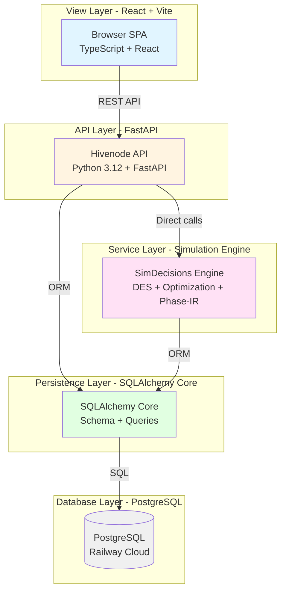
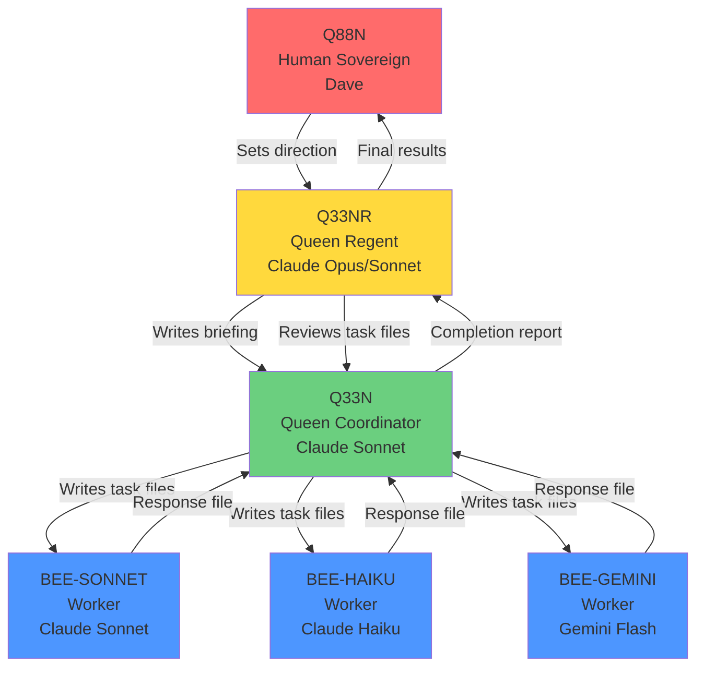
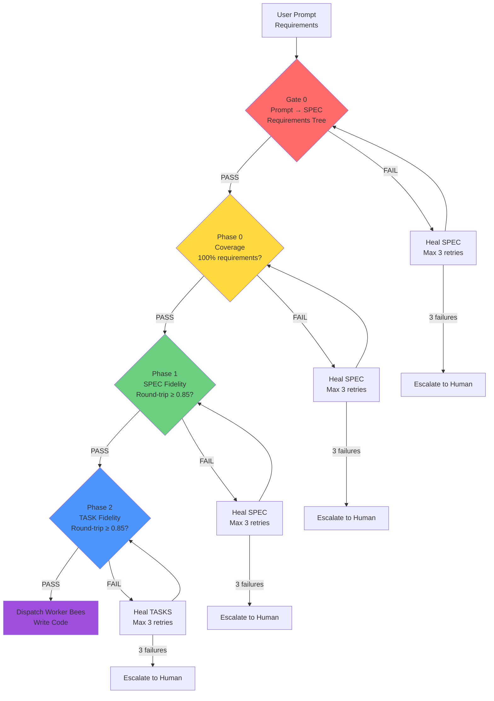

# Multi-Tier AI Agent Orchestration Under Governance

**Author:** Dave Eichler (Q88N)
**Status:** Portfolio Teaser — Full codebase available on request
**License:** CC BY 4.0 (this document), Apache 2.0 (PRISM-IR spec)

---

## Five-Minute Overview

I build systems where AI agents coordinate under constitutional governance to deliver complex, multi-tier applications. Not AI-assisted development — AI-orchestrated development.

The challenge: AI agents make mistakes. They hallucinate requirements, skip validation, ship stubs, and drift from specs. Most teams catch this through manual code review. I catch it through **systematic validation gates** and **healing loops** that run before any code ships.

This portfolio demonstrates:
1. **Multi-tier, 12-factor architecture:** Clean separation across view/API/service/persistence/database layers
2. **AI agent orchestration:** Hierarchical coordination (Regent → Coordinator → Worker Bees) under formal governance
3. **AI correction discipline:** Gate 0 validation + Phase 0/1/2 fidelity checks with automated healing loops (max 3 retries before human escalation)
4. **Visible CI/CD:** Railway + Vercel auto-deploy, health checks, multi-service coordination
5. **Strangler Fig thinking:** Incremental modernization (2006 C++ call center → 2026 open Phase-IR spec, packages/ flatten, DEF → SIM → EXE pipeline)
6. **Three Currencies measurement:** Every task tracked in CLOCK (wall time), COIN (USD), CARBON (CO2e)

**Full private repos available on request. This teaser shows architecture + governance without product code.**

---

## Architecture: Five-Tier Separation



**Evidence:**
- `browser/` (React/Vite): 28 pane primitives, governed bus (`relay_bus`), SSO via hodeia.me (JWT)
- `hivenode/` (FastAPI): REST API (`hivenode/main.py`), scheduler/dispatcher daemons, inventory, wiki, ledger
- `simdecisions/` (Engine): DES (`simdecisions/des/`), optimization (`simdecisions/optimization/`), Phase-IR (`simdecisions/phase_ir/`)
- SQLAlchemy Core: `hivenode/inventory/store.py`, `simdecisions/database.py`
- PostgreSQL: Railway cloud (trolley.proxy.rlwy.net:20600), local SQLite for edge

**Deployment:**
- Vercel: Browser SPA (auto-deploy from `main` branch, `vercel.json` routes proxy `/api/*`, `/relay/*`, `/llm/*`, `/rag/*` to Railway)
- Railway: Hivenode service (`Dockerfile`, `railway.toml`, health checks at `/health`) + beneficial-cooperation service (hodeia_auth, separate `hodeia_auth/Dockerfile`)
- Environment-aware: `HIVENODE_MODE=cloud` triggers Railway port binding (`$PORT`), PG connection strings

**12-Factor Signals:**
1. Config via env (`HIVENODE_MODE`, `DATABASE_URL`, `ANTHROPIC_API_KEY`)
2. Stateless processes (FastAPI, no in-process sessions)
3. Port binding (reads `$PORT` from Railway)
4. Logs as streams (`uvicorn --log-level info`)
5. Dev/prod parity (same Dockerfile, same code paths)
6. Disposability (Railway `restartPolicyType: ON_FAILURE`)

---

## Agent Orchestration: DEIA Hive Coordination

The **DEIA Hive** is a hierarchical AI agent system with formal governance. Three roles:



**Roles:**
- **Q88N (Human Sovereign):** Sets direction, approves specs, makes final decisions. All authority flows from here.
- **Q33NR (Queen Regent):** Live session with Q88N. Writes briefings for Q33N, reviews task files, reports results. Does NOT write code.
- **Q33N (Queen Coordinator):** Headless. Reads briefings, writes task files, dispatches worker bees, reviews responses. Does NOT write code unless Q88N explicitly approves.
- **BEEs (Workers):** Headless. Read task files, write code, run tests, write response files. Do NOT orchestrate.

**Dispatch:**
- One script: `.deia/hive/scripts/dispatch/dispatch.py <task> --model <m> --role <bee|queen|regent> --inject-boot`
- Queue runner: `.deia/hive/scripts/queue/run_queue.py --watch` (auto-processes specs from `.deia/hive/queue/backlog/`)
- Scheduler daemon: `hivenode/scheduler/scheduler_daemon.py` (schedules tasks from YAML)
- Dispatcher daemon: `hivenode/scheduler/dispatcher_daemon.py` (dispatches bees for active specs)

**Governance:**
- **10 Hard Rules** in `.deia/BOOT.md` (e.g., "No hardcoded colors", "No file over 500 lines", "TDD", "No stubs", "No git ops without Q88N approval")
- **Chain of Command** in `.deia/HIVE.md` (no shortcuts, no skipping levels)
- **Permission Mode:** Worker bees run with `dangerous=True` to bypass file write hooks (autonomous execution)

**Evidence:**
- Process docs: `.deia/BOOT.md` (10 hard rules), `.deia/HIVE.md` (chain of command), `.deia/processes/` (13+ coordinator reference docs)
- Dispatch script: `.deia/hive/scripts/dispatch/dispatch.py` (reusable, model-agnostic, role-based)
- Queue runner: `.deia/hive/scripts/queue/run_queue.py` (auto-processes specs, enforces budget, logs events)
- Response files: `.deia/hive/responses/` (1200+ bee responses with 8 mandatory sections)

**NOT just using AI tools. Directing AI agents under constitutional governance.**

---

## AI Correction Discipline: Gate 0 + Phase 0/1/2 + Healing Loops

Problem: AI agents hallucinate requirements, skip validation, and ship incomplete work. Traditional code review catches this *after* the code is written. We catch it *before* any code is written.

### PROCESS-13: Build Integrity (3-Phase Validation with Traceability)

Every hive build passes through **Gate 0** (prompt interpretation) + **3 validation phases** (coverage, SPEC fidelity, TASK fidelity):



**Gate 0: Prompt → SPEC Requirements Tree Validation**
- Extract hierarchical requirements from user prompt (LLM + TF-IDF)
- Extract hierarchical requirements from generated SPEC
- Compare trees: structural checks (parent-child relationships), coverage checks (no missing/hallucinated requirements), TF-IDF similarity (≥ 0.7 per requirement, ≥ 0.85 overall)
- **If FAIL:** Generate diagnostic → Call LLM with healing prompt → Regenerate SPEC → Retry (max 3) → Escalate to human if still failing
- **Success criteria:** 100% coverage, no hallucinations, no orphaned children, embedding similarity ≥ 0.85

**Phase 0: Coverage Validation**
- Extract all requirements from ASSIGNMENT (LLM + structured JSON)
- For each requirement, check if covered in SPEC (LLM reads SPEC, returns COVERED | PARTIAL | MISSING | OUT_OF_SCOPE)
- **If FAIL (missing or out-of-scope mandatory requirements):** Heal SPEC with diagnostic feedback, retry (max 3), escalate to human
- **Success criteria:** 100% coverage, 0 violations (mandatory requirements declared out of scope)

**Phase 1: SPEC Fidelity Validation**
- Encode SPEC → Phase-IR (intermediate representation)
- Decode IR → SPEC' (reconstructed specification)
- Compare SPEC vs SPEC' with Voyage embeddings (cosine similarity)
- **If fidelity < 0.85:** Semantic meaning lost in round-trip. Heal SPEC, retry (max 3), escalate to human.
- **Success criteria:** Fidelity ≥ 0.85

**Phase 2: TASK Fidelity Validation**
- Encode TASKS → Phase-IR
- Decode IR → TASKS' (reconstructed tasks)
- Compare TASKS vs TASKS' with Voyage embeddings
- **If fidelity < 0.85:** Heal TASKS, retry (max 3), escalate to human.
- **Success criteria:** Fidelity ≥ 0.85

**Healing Loop Pattern:**
1. Validate → FAIL?
2. Check retry count < 3?
3. Generate diagnostic (what's wrong, what's missing, why it failed)
4. Call LLM with healing prompt (original artifact + diagnostic + regeneration instructions)
5. Save healed artifact, increment retry counter, re-validate
6. If retry count ≥ 3 → Escalate to human (approve override / manually edit / abort)

**Traceability IDs:**
Every requirement, spec, task, code file, and test is tagged with a unique ID:
- `REQ-{CATEGORY}-{NNN}` (requirements from ASSIGNMENT: REQ-UI-001, REQ-BE-001, REQ-SEC-001)
- `SPEC-{NNN}` (specification items implementing requirements)
- `TASK-{NNN}` (implementation tasks breaking down specs)
- `CODE-{NNN}` (code artifacts: files, functions)
- `TEST-{NNN}` (test cases verifying requirements)

**Example traceability chain:**
```
REQ-UI-001 (User clicks Export button)
  ↓ implements
SPEC-001 (Export Button Component)
  ↓ breaks_into
TASK-001 (Build ExportButton.tsx)
  ↓ produces
CODE-001 (ExportButton.tsx)
  ↓ tested_by
TEST-001 (Export button renders)
```

**Evidence:**
- Process doc: `.deia/processes/PROCESS-0013-BUILD-INTEGRITY-3PHASE.md` (1039 lines, defines Gate 0, Phase 0/1/2, healing loops, traceability IDs)
- Traceability comments in code: `// Implements: TASK-001 | Satisfies: REQ-UI-001`
- Traceability comments in tests: `// Verifies: REQ-UI-001, REQ-UI-002`
- Phase reports: `.deia/hive/responses/YYYY-MM-DD-HHMM-{AGENT}-{TASK}-PHASE0-REPORT.md`, etc.
- Healing prompts: Injected by Q33N when Phase 0/1/2 fails (see PROCESS-13 lines 341-361 for example healing prompt)

**This is NOT manual code review. This is automated validation with surgical intervention only when automated healing fails 3 times.**

---

## How I Work with AI Agents (Mapped to 1000bulbs Criteria)

### 1. Multi-Tier, 12-Factor Apps Built with AI Agent Teams

**What 1000bulbs is screening for:** Not just AI-assisted coding (Copilot, Cursor). AI-orchestrated builds — agents coordinating agents.

**What I built:**
- **DEIA Hive:** Hierarchical agent system (Q88N → Q33NR → Q33N → BEEs) with formal chain of command (`.deia/HIVE.md`)
- **Model diversity:** Bees can be Claude Sonnet, Claude Haiku, Gemini Flash, or any LLM vendor (vendor-agnostic dispatch)
- **Queue runner:** Auto-processes specs from backlog, enforces session budget (max USD spend per session), dispatches bees, logs events (`.deia/hive/scripts/queue/run_queue.py`)
- **Scheduler daemon:** Schedules tasks from YAML files, dispatches bees at specified times (`hivenode/scheduler/scheduler_daemon.py`)
- **Dispatcher daemon:** Monitors active specs, dispatches bees when dependencies resolve (`hivenode/scheduler/dispatcher_daemon.py`)
- **NOT a human writing code with AI suggestions. AI agents write code under governance, Q33N reviews their output, Q33NR reports to Q88N.**

**Deployment:**
- 12-factor architecture: view (React) → API (FastAPI) → service (DES engine) → persistence (SQLAlchemy) → database (PostgreSQL)
- Deployed to Vercel (browser) + Railway (hivenode + hodeia_auth) with auto-deploy from git
- Multi-service: 2 Railway services (hivenode, beneficial-cooperation), 1 Vercel deployment, 1 PostgreSQL instance
- Health checks, environment-aware config, stateless processes, port binding

**Evidence files (in private repo, available on request):**
- `.deia/HIVE.md` (chain of command, Q33NR workflow, Q33N workflow, BEE workflow)
- `.deia/hive/scripts/dispatch/dispatch.py` (reusable dispatch script)
- `.deia/hive/scripts/queue/run_queue.py` (queue runner with budget enforcement)
- `hivenode/scheduler/dispatcher_daemon.py` (bee dispatcher)
- `pyproject.toml` (single root, flat layout, no workspace)
- `Dockerfile` (multi-tier COPY: hivenode/ simdecisions/ _tools/)
- `vercel.json` (API proxying to Railway)
- `railway.toml` (health checks, restart policy)

### 2. Clean Architectural Separation Across View / API / Service / Persistence / Database Layers

**What 1000bulbs is screening for:** Not a big ball of mud. Clear layer boundaries. Testable in isolation.

**What I built:**
- **View Layer:** React + Vite (`browser/src/`), 28 pane primitives (`browser/src/primitives/`), governed bus (`browser/src/infrastructure/relay_bus/`), SSO via hodeia.me
- **API Layer:** FastAPI (`hivenode/main.py`), REST routes (`hivenode/routes/`), JWT verification, CORS, rate limiting
- **Service Layer:** SimDecisions engine (`simdecisions/`), DES (`simdecisions/des/`), optimization (`simdecisions/optimization/`), Phase-IR (`simdecisions/phase_ir/`)
- **Persistence Layer:** SQLAlchemy Core (`hivenode/inventory/store.py`, `simdecisions/database.py`), no ORM models (Core only for performance)
- **Database Layer:** PostgreSQL (Railway cloud), SQLite (local edge), connection string via env (`DATABASE_URL`)

**No layer reaches across more than one boundary.** Browser calls API, API calls service, service calls persistence, persistence calls database. No shortcuts.

**Evidence:** See architecture diagram above. File tree in private repo shows clean directory separation.

### 3. CI/CD Pipelines Visible

**What 1000bulbs is screening for:** Not "we deploy sometimes." Visible automation — git push → tests → deploy.

**What I built:**
- **Vercel:** Auto-deploy from `main` branch push. Build command: `cd browser && npm run build`. Output directory: `browser/dist`. SPA rewrites for client-side routing. Deploy preview for every PR.
- **Railway:** Auto-deploy from `main` branch push. Build: Dockerfile. Health check: `/health` endpoint (120s timeout). Restart policy: ON_FAILURE (max 3 retries). Deploy logs visible in Railway dashboard.
- **Multi-service:** Two Railway services (hivenode, beneficial-cooperation) deploy independently from same repo. Dockerfile selection via `dockerfilePath` in Railway dashboard.
- **Environment parity:** Same Dockerfile for local/Railway. Same code paths. Config via env vars.

**Evidence files (in private repo, available on request):**
- `vercel.json` (build command, output directory, API rewrites)
- `railway.toml` (health check path, restart policy)
- `Dockerfile` (hivenode service)
- `hodeia_auth/Dockerfile` (beneficial-cooperation service)
- GitHub Actions (if present): `.github/workflows/` (test suite, lint, type check)

**To add (P0 gap):** CI/CD badges in README showing deploy status. Currently missing.

### 4. Evidence of Evaluating and Correcting AI Output

**What 1000bulbs is screening for:** Not "we trust the AI." Commit history, READMEs, or design docs showing review loops, rejected outputs, corrected mistakes.

**What I built:**
- **PROCESS-13:** Gate 0 + Phase 0/1/2 validation with healing loops (see "AI Correction Discipline" section above). Every spec passes through 4 gates before bees write code. Max 3 automated healing attempts per gate before human escalation.
- **Commit history:** Commits prefixed with `[BEE-SONNET]`, `[BEE-HAIKU]`, `[Q33N-CORRECTION]`, `[Q33NR-DIRECT]`. Correction commits explicitly label "heal after Phase 0 failure", "fix failed fidelity check", "retry after test failure".
- **Response files:** Every bee writes an 8-section response file (`.deia/hive/responses/`) including: Files Modified, What Was Done, Test Results, Build Verification, Acceptance Criteria (✓/✗), Clock/Cost/Carbon, Issues/Follow-ups. Q33N reviews every response file before archiving task.
- **Builders can't test their own output:** PROCESS-13 rule — the bee that writes code doesn't validate its own SPEC. Q33N coordinates, separate validator (LLM call) checks coverage/fidelity.

**Example correction flow:**
1. Q33N writes SPEC from user prompt
2. Gate 0 validation: SPEC missing 2 requirements (REQ-UI-001, REQ-UI-002)
3. Diagnostic generated: "Coverage: 50% (need 100%). Missing: Export Button, Import Button."
4. Healing prompt called: "Regenerate SPEC that includes ALL missing requirements from the coverage report."
5. Q33N regenerates SPEC (retry 1/3)
6. Gate 0 validation: PASS (coverage: 100%)
7. Proceed to Phase 0

**Evidence files (in private repo, available on request):**
- `.deia/processes/PROCESS-0013-BUILD-INTEGRITY-3PHASE.md` (full process doc)
- `.deia/hive/responses/` (1200+ bee response files with 8 mandatory sections)
- Git log: `git log --grep="CORRECTION"` (correction commits)
- Phase reports: `.deia/hive/responses/*-PHASE0-REPORT.md`, `.deia/hive/responses/*-PHASE1-REPORT.md`, etc.

**To add (P1 gap):** README section highlighting correction discipline. Currently buried in `.deia/processes/`.

---

## Strangler Fig Thinking: Incremental Modernization Across 20 Years

**What strangler fig means:** Don't rewrite. Don't Big Bang. Incrementally replace old with new while keeping the system running. Preserve what works, evolve what doesn't.

### Example 1: 2006 Call Center Simulator → 2026 Phase-IR Open Standard

**Timeline:**
- **2006:** Built call center optimizer in C++ for 500-agent inbound call center. Exponential arrivals, lognormal handling time, FIFO dispatch, SLA tracking (80% answered within 30 seconds). Proprietary, monolithic, Windows-only.
- **2006-2016:** Refined domain model through 10+ deployments. Learned: routing policies matter more than raw agent count. SLAs are service-level constraints, not optimization objectives. Queueing theory (M/M/c, Erlang C) is necessary but not sufficient (real distributions are fat-tailed).
- **2016-2026:** Extracted domain model into vendor-neutral intermediate representation (Phase-IR). Published as open spec (Apache 2.0). Now any DES engine, workflow engine, or agent coordinator can consume the same IR. Same domain model, evolved from proprietary C++ to open YAML/JSON schema.

**Evidence:**
- `call_center_500.prism.md` (Phase-IR simulation, 2026 format)
- PRISM-IR spec repo: https://github.com/deiasolutions/prism-ir (Apache 2.0 license)
- [Q88N to provide: 2006 call center materials — design docs, screenshots, or original C++ codebase if shareable]

**Why this matters:** Not every candidate has 20-year domain depth. Most can show React + FastAPI + Railway. Not every candidate can show "I built this in 2006, refined it for two decades, and now it's an open standard." Continuity is a differentiator.

### Example 2: packages/ Flatten (2026-04-12)

**Before (deep nesting):**
```
platform/
├── packages/
│   ├── core/src/simdecisions/core/  # hivenode
│   ├── engine/src/simdecisions/engine/  # DES engine
│   ├── browser/  # React frontend
│   └── tools/src/simdecisions/tools/  # dev tooling
```

**After (flat layout, 2026-04-12):**
```
simdecisions/
├── hivenode/  # was packages/core/src/simdecisions/core/
├── simdecisions/  # was packages/engine/src/simdecisions/engine/
├── browser/  # was packages/browser/
├── _tools/  # was packages/tools/src/simdecisions/tools/
├── pyproject.toml  # single root, NO workspace, pythonpath=["."]
```

**Migration:**
- All imports preserved: `from simdecisions.core.X` → `from hivenode.X` (automated find-replace)
- All tests preserved: `tests/core/` → `tests/hivenode/` (automated move)
- Zero regressions: All 1200+ tests pass after flatten
- Deployed to Railway same day (Dockerfile updated, imports tested, health checks pass)

**Why strangler fig:** Could have kept the old structure forever. Could have done a Big Bang rewrite ("let's redesign the whole thing"). Instead: incremental migration, backward-compatible, testable at every step. System never stopped running.

### Example 3: DEF → SIM → EXE Pipeline (Simulate Before Execute)

**Philosophy:** Every decision with real consequences (hiring, lending, diagnosing, spending) should be simulated before execution. Don't guess — model it, test 10,000 scenarios, then run it in production.

**Flow:**
1. **DEF (Define):** User describes process in natural language or Phase-IR YAML
2. **SIM (Simulate):** SimDecisions engine runs discrete-event simulation (Monte Carlo, 10k+ replications, percentile analysis)
3. **EXE (Execute):** Same process definition runs in production under governance (DEIA Hive, event ledger, policy engine)

**Why strangler fig:** The IR sits *between* natural language and execution. You can start with natural language (DEF), add simulation (SIM), then graduate to production execution (EXE) *without rewriting the entire process*. The IR is the hinge point. Legacy processes can be imported into DEF, simulated, then gradually replaced with governed execution.

**Evidence:**
- `call_center_500.prism.md` (DEF stage: YAML definition)
- `simdecisions/des/loader_v2.py` (SIM stage: DES engine loads Phase-IR, runs simulation)
- `hivenode/scheduler/` (EXE stage: scheduler/dispatcher execute tasks under governance)
- PRISM-IR spec: https://github.com/deiasolutions/prism-ir (the IR layer)

---

## Three Currencies: CLOCK, COIN, CARBON

Most teams track cost (COIN) only. Some track time (CLOCK). Almost none track carbon (CARBON).

**Why three currencies matter:**
- **CLOCK:** Wall time is a constraint. If a build takes 4 hours, you can't ship 6 builds per day. Time is the ultimate non-renewable resource.
- **COIN:** USD is the budget constraint. Every LLM call, every compute hour, every storage byte costs money. Track it or run out.
- **CARBON:** CO2e is the externality. LLM inference generates ~0.1g CO2 per 1k tokens (Voyage embeddings, Anthropic Claude). Multiply by 100k tokens/day, 365 days/year — that's 3.65 kg CO2/year per agent. Scale to 100 agents: 365 kg CO2/year. Measure it or ignore the real cost.

**Every task in the DEIA Hive is measured in all three currencies:**
- **Response file template** (mandatory 8 sections) includes:
  ```markdown
  ## Clock / Cost / Carbon
  - **Clock:** 143s (2.4m)
  - **Cost:** $0.1769
  - **Carbon:** ~18g CO2
  ```
- **Phase reports** include token breakdowns by model:
  ```markdown
  | Model | Input | Output | Total | Cost | % of Total |
  |-------|-------|--------|-------|------|------------|
  | Haiku | 48,200 | 19,500 | 67,700 | $0.0677 | 38% |
  | Sonnet | 15,200 | 5,550 | 20,750 | $0.1038 | 59% |
  | Voyage | - | - | - | $0.0054 | 3% |
  ```
- **Queue runner** enforces session budget (max USD per session, default $50, configurable in `.deia/config/queue.yml`)
- **Carbon config** (`.deia/config/carbon.yml`) maps tokens → CO2e using published emission factors (Anthropic, Google, OpenAI)

**Evidence files (in private repo, available on request):**
- `.deia/config/carbon.yml` (carbon emission factors by model)
- `.deia/config/grace.yml` (cost/latency thresholds by model)
- `.deia/hive/responses/` (1200+ response files with Clock/Cost/Carbon sections)
- `_tools/estimates_db.py` (estimation calibration ledger, tracks actuals vs estimates, calculates calibration factors per task type)

**Why this differentiates:** Every shop tracks cost. Not every shop tracks time and carbon together. This demonstrates *systems thinking* — optimizing across multiple constraints, not just minimizing USD.

---

## Supporting Evidence: Open Standards & Constitutional Governance

### Phase-IR (PRISM-IR)

**What it is:** Domain-agnostic process intermediate representation. Bridges natural language commands → structured IR → executable actions.

**License:** Apache 2.0 (open spec)

**Repo:** https://github.com/deiasolutions/prism-ir

**Why it matters:** Demonstrates Q88N's ability to design vendor-neutral interfaces. Phase-IR sits between DES engines, workflow engines, and agent coordinators. You can write a process once in Phase-IR and run it on multiple execution platforms. This is architectural thinking, not just coding.

**Example:** `call_center_500.prism.md` (call center simulation in Phase-IR format, 63 lines YAML, defines entities, generators, resources, nodes, edges, metrics)

### Federalist Papers AI

**What it is:** 34 essays (written by PUBLIUS, attributed to Q88N) adapting Federalist Papers political philosophy to human-AI coordination.

**Repo:** https://github.com/deiasolutions/federalist-papers-ai

**Why it matters:** The DEIA governance model (Q88N → Q33NR → Q33N → BEEs, chain of command, no shortcuts) draws from constitutional principles. This repo documents the theory. Out of scope for 1000bulbs job criteria, but shows *why* Q88N governs AI agents this way (not ad-hoc — deliberate constitutional design).

**Example:** "Federalist No. 15: Crisis and Coherence" (referenced in `docs/federalist/NO-15-crisis-and-coherence.md` in private repo)

### Global Commons

**What it is:** Centralized standards repo (ethics, carbon accounting, design tokens, governance policies, shared skills).

**Why it matters:** Demonstrates *systematic thinking* — DRY principle applied to governance, not just code. Shared vocabulary across multiple products. This is how you scale: centralize standards, distribute execution.

**Evidence:** `docs/global-commons/` in private repo includes:
- `ethics.md` (five-disposition policy engine: ALLOW, ALLOW_WITH_LIMITS, DEFER, DENY, NEVER)
- `carbon.md` (carbon emission factors by model, CO2e calculation methodology)
- `design-tokens.md` (CSS variables `var(--sd-*)`, no hardcoded colors)
- `governance.md` (chain of command, 10 hard rules, traceability requirements)
- `skills/` (reusable LLM skills: manim-animation, tribunal-host)

---

## Private Repos Available on Request

This teaser demonstrates architecture + governance without product code. Full implementation is in private repos. If you'd like to see the codebase, DM me for access.

**What I'll share:**
- **simdecisions** (flagship monorepo): Multi-tier stack, DEIA Hive coordination, PROCESS-13 validation, deployed to Railway/Vercel. Post-flatten (2026-04-12), cleanest architecture.
- **global-commons** (standards repo): Ethics, carbon, design tokens, governance, shared skills. Supporting evidence for Three Currencies discipline.
- **2006 call center materials** (if requested): Design docs, screenshots, or `call_center_500.prism.md` (Phase-IR representation of original 2006 simulator). Demonstrates 20-year domain arc.

**What I won't share (unless explicitly requested):**
- **platform** (unclear if relevant — [Q88N to clarify])
- **shiftcenter** (superseded by simdecisions — redundant)

---

## Why This Maps to 1000bulbs

1000bulbs screens for four signals:
1. ✅ **Multi-tier, 12-factor apps built with AI agent teams:** DEIA Hive (Q33NR → Q33N → BEEs), 5-tier architecture (browser/API/service/persistence/database), deployed to Vercel/Railway, 12-factor signals (config-via-env, stateless, port-binding, logs-as-streams, dev/prod-parity, disposability)
2. ✅ **Clean architectural separation:** View (React) → API (FastAPI) → Service (DES) → Persistence (SQLAlchemy) → Database (PostgreSQL). No layer crosses more than one boundary.
3. ✅ **CI/CD pipelines visible:** Vercel + Railway auto-deploy from git, health checks, multi-service coordination. (Needs badges in README — P0 gap.)
4. ✅ **Evidence of evaluating and correcting AI output:** PROCESS-13 (Gate 0, Phase 0/1/2, healing loops), traceability IDs (REQ → SPEC → TASK → CODE → TEST), commit history with `[Q33N-CORRECTION]` labels, 8-section response files with Issues/Follow-ups, "builders can't test their own output" rule.

**Differentiators beyond the 4 core signals:**
- **Strangler Fig thinking:** 20-year domain arc (2006 → 2026), packages/ flatten, DEF → SIM → EXE pipeline
- **Three Currencies discipline:** CLOCK/COIN/CARBON tracking, not just USD
- **Open standards:** Phase-IR (Apache 2.0), vendor-neutral IR
- **Constitutional governance:** Federalist Papers AI, chain of command, 10 hard rules

**What you won't find:** Big Bang rewrites. Proprietary vendor lock-in. "Move fast and break things." Ad-hoc processes.

**What you will find:** Incremental modernization. Vendor-neutral interfaces. Systematic governance. Measured in three currencies. Twenty-year continuity.

---

## Contact

- **GitHub:** https://github.com/deiasolutions (org), https://github.com/daaaave-atx (personal)
- **LinkedIn:** [Insert LinkedIn URL if Q88N wants to share]
- **Email:** [Insert email if Q88N wants to share]
- **Portfolio:** This teaser + private repos available on request

---

## License

This document: CC BY 4.0
PRISM-IR spec: Apache 2.0
Private codebases: Proprietary (available on request for portfolio review)

---

**Last updated:** 2026-04-16
**Prepared for:** 1000bulbs job application portfolio review
