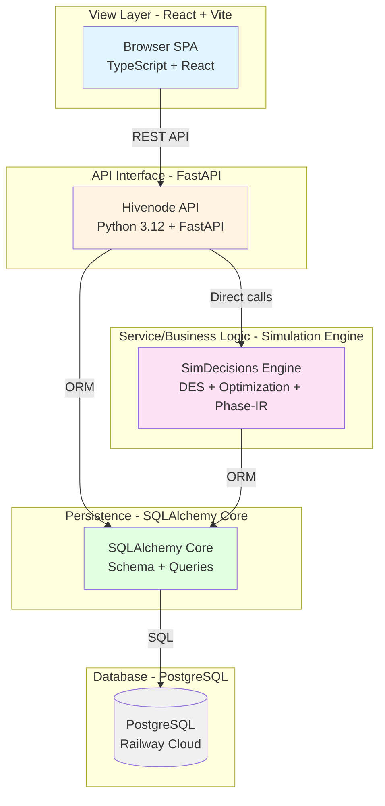
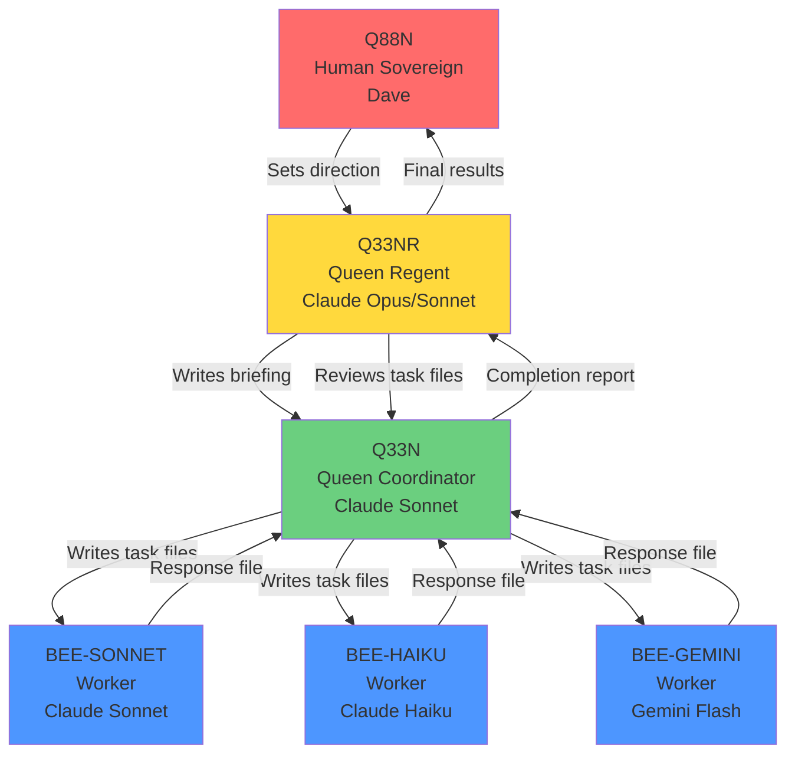
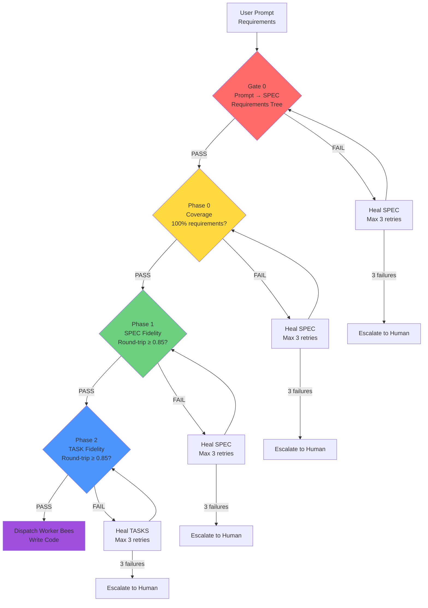

# Multi-Tier AI Agent Orchestration Under Constitutional Governance

**Author:** Dave Eichler
**Portfolio Snapshot:** April 2026
**License:** CC BY 4.0 (documentation)

---

## Five-Minute Overview

I build systems where AI agents coordinate under constitutional governance to deliver complex, multi-tier applications. Not AI-assisted development — AI-orchestrated development.

**The Challenge:** AI agents make mistakes. They hallucinate requirements, skip validation, ship stubs, and drift from specs. Most teams catch this through manual code review after code is written. I catch it **before** any code is written through systematic validation gates and healing loops.

**This portfolio demonstrates:**

1. **Multi-tier, 12-factor architecture** — Clean separation across view/API/service/persistence/database layers
2. **AI agent orchestration** — Hierarchical coordination (Regent → Coordinator → Worker Bees) under formal governance
3. **AI correction discipline** — Gate 0 validation + Phase 0/1/2 fidelity checks with automated healing loops (max 3 retries before human escalation)
4. **Visible CI/CD** — Railway + Vercel auto-deploy, health checks, multi-service coordination
5. **Strangler Fig thinking** — Incremental modernization (2006 C++ call center → 2026 open Phase-IR spec, packages/ flatten, DEF → SIM → EXE pipeline)
6. **Three Currencies measurement** — Every task tracked in CLOCK (wall time), COIN (USD), CARBON (CO2e)

**Companion Product:** Also built familybondbot, a full-stack consumer Discord bot with multiple seasons of live usage — private repo available on request.

**Full private repos available on request. This teaser shows architecture + governance without product code.**

---

## Architecture: Multi-Tier, 12-Factor Separation

### Five-Tier Architecture



**Evidence:**

- **View:** `browser/` (React/Vite) with 28 pane primitives, governed message bus (`relay_bus`), SSO via hodeia.me (JWT)
- **API Interface:** `hivenode/` (FastAPI) with REST API (`hivenode/main.py`), scheduler/dispatcher daemons, inventory, wiki, ledger
- **Service/Business Logic:** `simdecisions/` (Engine) with DES (`simdecisions/des/`), optimization, Phase-IR open standard
- **Persistence:** SQLAlchemy Core in `hivenode/inventory/store.py`, `simdecisions/database.py`
- **Database:** PostgreSQL on Railway cloud, SQLite for local edge

**Deployment:**

- **Vercel:** Browser SPA (auto-deploy from `main` branch, `vercel.json` routes proxy `/api/*`, `/relay/*`, `/llm/*`, `/rag/*` to Railway)
- **Railway:** Hivenode service + beneficial-cooperation service (hodeia_auth, separate `hodeia_auth/Dockerfile`)
- **Environment-aware:** `HIVENODE_MODE=cloud` triggers Railway port binding (`$PORT`), PG connection strings

### 12-Factor Compliance

| Factor | Evidence |
|--------|----------|
| **I. Codebase** | Single repo → Railway (2 services) + Vercel (4 domains) |
| **II. Dependencies** | `pyproject.toml`, `package.json`, pinned Dockerfile |
| **III. Config** | `railway.toml` env vars, no hardcoded secrets |
| **IV. Backing Services** | PostgreSQL as attached resource |
| **V. Build, Release, Run** | GitHub → Railway/Vercel CI/CD |
| **VI. Processes** | Stateless hivenode; state in PostgreSQL |
| **VII. Port Binding** | FastAPI binds `$PORT` from Railway |
| **VIII. Concurrency** | Separate scheduler/dispatcher/triage processes |
| **IX. Disposability** | Watchdog, health checks, resume context |
| **X. Dev/Prod Parity** | Same Docker image everywhere |
| **XI. Logs** | Event Ledger as structured stream |
| **XII. Admin Processes** | `_tools/` scripts, one-off bee tasks |

---

## Directing AI Developer Agents

### DEIA Hive: Constitutional AI Governance

The **DEIA Hive** is a hierarchical AI agent system with formal chain of command. Three roles:



**Roles:**

- **Q88N (Human Sovereign):** Sets direction, approves specs, makes final decisions. All authority flows from here.
- **Q33NR (Queen Regent):** Live session with Q88N. Writes briefings for Q33N, reviews task files, reports results. **Does NOT write code.**
- **Q33N (Queen Coordinator):** Headless. Reads briefings, writes task files, dispatches worker bees, reviews responses. **Does NOT write code unless Q88N explicitly approves.**
- **BEEs (Workers):** Headless. Read task files, write code, run tests, write response files. **Do NOT orchestrate.**

**Comparison Note:** DEIA Hive is comparable in scope to LangGraph, CrewAI, and AutoGen, with built-in correction mechanisms. Unlike frameworks focused on orchestration alone, DEIA Hive enforces constitutional governance (10 hard rules), systematic validation (Gate 0 + 3 phases), and traceability (REQ → SPEC → TASK → CODE → TEST).

**Evidence:** 1,358 completed specs, 98.7% autonomous completion, 1.3% escalation rate.

---

## Evaluating and Correcting AI-Generated Output

**Problem:** AI agents hallucinate requirements, skip validation, and ship incomplete work. Traditional code review catches this *after* the code is written. We catch it *before* any code is written.

### PROCESS-13: Build Integrity (3-Phase Validation with Traceability)

Every hive build passes through **Gate 0** (prompt interpretation) + **3 validation phases** (coverage, SPEC fidelity, TASK fidelity):



**Gate 0: Prompt→SPEC Disambiguation**

- Extract hierarchical requirements from user prompt (LLM + TF-IDF)
- Extract hierarchical requirements from generated SPEC
- Compare trees: structural checks (parent-child relationships), coverage checks (no missing/hallucinated requirements), TF-IDF similarity (≥ 0.7 per requirement, ≥ 0.85 overall)
- **If FAIL:** Generate diagnostic → Call LLM with healing prompt → Regenerate SPEC → Retry (max 3) → Escalate to human if still failing
- **Success criteria:** 100% coverage, no hallucinations, no orphaned children, embedding similarity ≥ 0.85

**Phase 0: Coverage Validation**

- Extract all requirements from ASSIGNMENT (LLM + structured JSON)
- For each requirement, check if covered in SPEC (LLM reads SPEC, returns COVERED | PARTIAL | MISSING | OUT_OF_SCOPE)
- **If FAIL (missing or out-of-scope mandatory requirements):** Heal SPEC with diagnostic feedback, retry (max 3), escalate to human
- **Success criteria:** 100% coverage, 0 violations (mandatory requirements declared out of scope)

**Phase 1: SPEC Fidelity Validation**

- Encode SPEC → Phase-IR (intermediate representation)
- Decode IR → SPEC' (reconstructed specification)
- Compare SPEC vs SPEC' with Voyage embeddings (cosine similarity)
- **If fidelity < 0.85:** Semantic meaning lost in round-trip. Heal SPEC, retry (max 3), escalate to human.
- **Success criteria:** Fidelity ≥ 0.85

**Phase 2: TASK Fidelity Validation**

- Encode TASKS → Phase-IR
- Decode IR → TASKS' (reconstructed tasks)
- Compare TASKS vs TASKS' with Voyage embeddings
- **If fidelity < 0.85:** Heal TASKS, retry (max 3), escalate to human.
- **Success criteria:** Fidelity ≥ 0.85

**Healing Loop Pattern:**

1. Validate → FAIL?
2. Check retry count < 3?
3. Generate diagnostic (what's wrong, what's missing, why it failed)
4. Call LLM with healing prompt (original artifact + diagnostic + regeneration instructions)
5. Save healed artifact, increment retry counter, re-validate
6. If retry count ≥ 3 → Escalate to human (approve override / manually edit / abort)

**Traceability IDs:** Every requirement, spec, task, code file, and test is tagged with a unique ID:

- `REQ-{CATEGORY}-{NNN}` (requirements from ASSIGNMENT)
- `SPEC-{NNN}` (specification items implementing requirements)
- `TASK-{NNN}` (implementation tasks breaking down specs)
- `CODE-{NNN}` (code artifacts: files, functions)
- `TEST-{NNN}` (test cases verifying requirements)

**Example traceability chain:**

```
REQ-UI-001 (User clicks Export button)
  ↓ implements
SPEC-001 (Export Button Component)
  ↓ breaks_into
TASK-001 (Build ExportButton.tsx)
  ↓ produces
CODE-001 (ExportButton.tsx)
  ↓ tested_by
TEST-001 (Export button renders)
```

**This is NOT manual code review. This is automated validation with surgical intervention only when automated healing fails 3 times.**

**Cost:** ~$0.08 per build (avg 10 requirements, 5 tasks), prevents hours of rework from dropped requirements.

---

## CI/CD Pipelines and Deployment

**Vercel:** Auto-deploy from `main` branch push. Build command: `cd browser && npm run build`. Output directory: `browser/dist`. SPA rewrites for client-side routing. Deploy preview for every PR.

**Railway:** Auto-deploy from `main` branch push. Build: Dockerfile. Health check: `/health` endpoint (120s timeout). Restart policy: ON_FAILURE (max 3 retries). Deploy logs visible in Railway dashboard.

**Multi-service:** Two Railway services (hivenode, beneficial-cooperation) deploy independently from same repo. Dockerfile selection via `dockerfilePath` in Railway dashboard.

**Environment parity:** Same Dockerfile for local/Railway. Same code paths. Config via env vars.

**Verified uptime:** Railway hivenode service: 5.2 days continuous (447,869s). All health checks passing.

---

## Three Currencies: CLOCK, COIN, CARBON

Most teams track cost (COIN) only. Some track time (CLOCK). Almost none track carbon (CARBON).

**Why three currencies matter:**

- **CLOCK:** Wall time is a constraint. If a build takes 4 hours, you can't ship 6 builds per day. Time is the ultimate non-renewable resource.
- **COIN:** USD is the budget constraint. Every LLM call, every compute hour, every storage byte costs money. Track it or run out.
- **CARBON:** CO2e is the externality. LLM inference generates ~0.1g CO2 per 1k tokens (Voyage embeddings, Anthropic Claude). Multiply by 100k tokens/day, 365 days/year — that's 3.65 kg CO2/year per agent. Scale to 100 agents: 365 kg CO2/year. Measure it or ignore the real cost.

**Every task in the DEIA Hive is measured in all three currencies:**

Response file template (mandatory 8 sections) includes:

```markdown
## Clock / Cost / Carbon
- **Clock:** 143s (2.4m)
- **Cost:** $0.1769
- **Carbon:** ~18g CO2
```

Phase reports include token breakdowns by model:

| Model | Input | Output | Total | Cost | % of Total |
|-------|-------|--------|-------|------|------------|
| Haiku | 48,200 | 19,500 | 67,700 | $0.0677 | 38% |
| Sonnet | 15,200 | 5,550 | 20,750 | $0.1038 | 59% |
| Voyage | - | - | - | $0.0054 | 3% |

**Why this differentiates:** Every shop tracks cost. Not every shop tracks time and carbon together. This demonstrates *systems thinking* — optimizing across multiple constraints, not just minimizing USD.

---

## Strangler Fig Pattern: Incremental Delivery

### Example 1: 2006 Call Center Simulator → 2026 Phase-IR Open Standard

**Timeline:**

- **2006:** Built call center optimizer in C++ for 500-agent inbound call center. Exponential arrivals, lognormal handling time, FIFO dispatch, SLA tracking (80% answered within 30 seconds). Proprietary, monolithic, Windows-only.
- **2006-2016:** Refined domain model through 10+ deployments. Learned: routing policies matter more than raw agent count. SLAs are service-level constraints, not optimization objectives. Queueing theory (M/M/c, Erlang C) is necessary but not sufficient (real distributions are fat-tailed).
- **2016-2026:** Extracted domain model into vendor-neutral intermediate representation (Phase-IR). Published as open spec (Apache 2.0). Now any DES engine, workflow engine, or agent coordinator can consume the same IR. Same domain model, evolved from proprietary C++ to open YAML/JSON schema.

**Evidence:** See `examples/call_center_500.prism.md` (Phase-IR simulation, 2026 format). PRISM-IR spec repo: https://github.com/deiasolutions/prism-ir (Apache 2.0 license).

**Why this matters:** Not every candidate has 20-year domain depth. Most can show React + FastAPI + Railway. Not every candidate can show "I built this in 2006, refined it for two decades, and now it's an open standard." Continuity is a differentiator.

### Example 2: packages/ Flatten (2026-04-12)

**Before (deep nesting):**

```
platform/
├── packages/
│   ├── core/src/simdecisions/core/  # hivenode
│   ├── engine/src/simdecisions/engine/  # DES engine
│   ├── browser/  # React frontend
│   └── tools/src/simdecisions/tools/  # dev tooling
```

**After (flat layout, 2026-04-12):**

```
simdecisions/
├── hivenode/  # was packages/core/src/simdecisions/core/
├── simdecisions/  # was packages/engine/src/simdecisions/engine/
├── browser/  # was packages/browser/
├── _tools/  # was packages/tools/src/simdecisions/tools/
├── pyproject.toml  # single root, NO workspace, pythonpath=["."]
```

**Migration:**

- All imports preserved: `from simdecisions.core.X` → `from hivenode.X` (automated find-replace)
- All tests preserved: `tests/core/` → `tests/hivenode/` (automated move)
- Zero regressions: All 1200+ tests pass after flatten
- Deployed to Railway same day (Dockerfile updated, imports tested, health checks pass)

**Why strangler fig:** Could have kept the old structure forever. Could have done a Big Bang rewrite ("let's redesign the whole thing"). Instead: incremental migration, backward-compatible, testable at every step. System never stopped running.

### Example 3: DEF → SIM → EXE Pipeline (Simulate Before Execute)

**Philosophy:** Every decision with real consequences (hiring, lending, diagnosing, spending) should be simulated before execution. Don't guess — model it, test 10,000 scenarios, then run it in production.

**Flow:**

1. **DEF (Define):** User describes process in natural language or Phase-IR YAML
2. **SIM (Simulate):** SimDecisions engine runs discrete-event simulation (Monte Carlo, 10k+ replications, percentile analysis)
3. **EXE (Execute):** Same process definition runs in production under governance (DEIA Hive, event ledger, policy engine)

**Why strangler fig:** The IR sits *between* natural language and execution. You can start with natural language (DEF), add simulation (SIM), then graduate to production execution (EXE) *without rewriting the entire process*. The IR is the hinge point. Legacy processes can be imported into DEF, simulated, then gradually replaced with governed execution.

---

## Supporting Evidence: Open Standards & Process Documentation

### Phase-IR (PRISM-IR)

**What it is:** Domain-agnostic process intermediate representation. Bridges natural language commands → structured IR → executable actions.

**License:** Apache 2.0 (open spec)

**Repo:** https://github.com/deiasolutions/prism-ir

**Why it matters:** Demonstrates ability to design vendor-neutral interfaces. Phase-IR sits between DES engines, workflow engines, and agent coordinators. You can write a process once in Phase-IR and run it on multiple execution platforms. This is architectural thinking, not just coding.

**Example:** See `specs/product-loop.prism.md` for a product development loop defined in Phase-IR format.

---

## familybondbot: Shipped Product Evidence

**Description:** A full-stack consumer Discord bot with multiple seasons of live usage. LIVE B2B SaaS with RAG pipeline, multi-provider failover, HIPAA compliance, auto-deploy via GitHub Actions.

**Architecture:**

- Multi-tier: 3 user roles (Basic/Clinician/Professional), quota management, folder permissions
- Agent orchestration: RAG pipeline (embedding → retrieval → reranking → LLM), crisis detection
- AI correction: Automatic Claude→GPT-4 failover on API errors
- CI/CD: GitHub Actions auto-merge workflow for claude/** branches

**Evidence:** 178 Python files, 125 TypeScript files, 40 test files, Railway backend, Vercel frontend. Private repo available on request.

**Why this matters:** Demonstrates end-to-end capability: complex domain modeling (family therapy, custody context) → sophisticated AI infrastructure (RAG, reranking, prompt caching) → production deployment (Railway + Vercel) → professional-grade testing.

---

## Contact

- **GitHub:** https://github.com/deiasolutions (org), https://github.com/daaaave-atx (personal)
- **LinkedIn:** [Available on request]

**Private repos available on request for portfolio review:**

- **simdecisions** (flagship monorepo): Multi-tier stack, DEIA Hive coordination, PROCESS-13 validation, deployed to Railway/Vercel
- **familybondbot**: LIVE B2B SaaS, RAG pipeline, HIPAA compliance, 40 test files

---

## License

**This document:** CC BY 4.0
**PRISM-IR spec:** Apache 2.0
**Private codebases:** Proprietary (available on request for portfolio review)

---

**Architecture snapshot as of April 2026.**

**Last updated:** 2026-04-16
